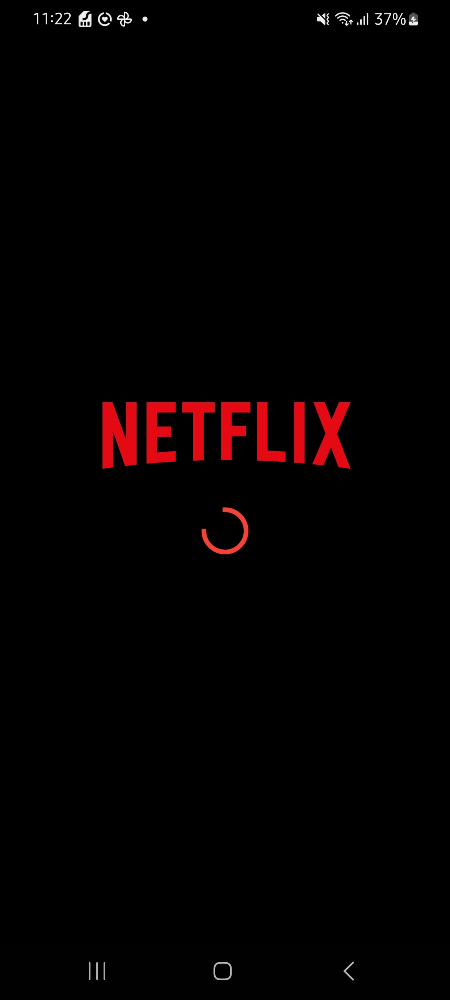
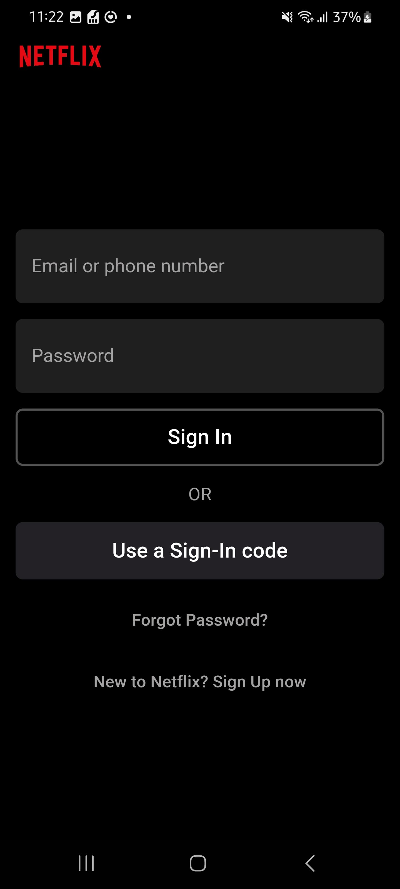
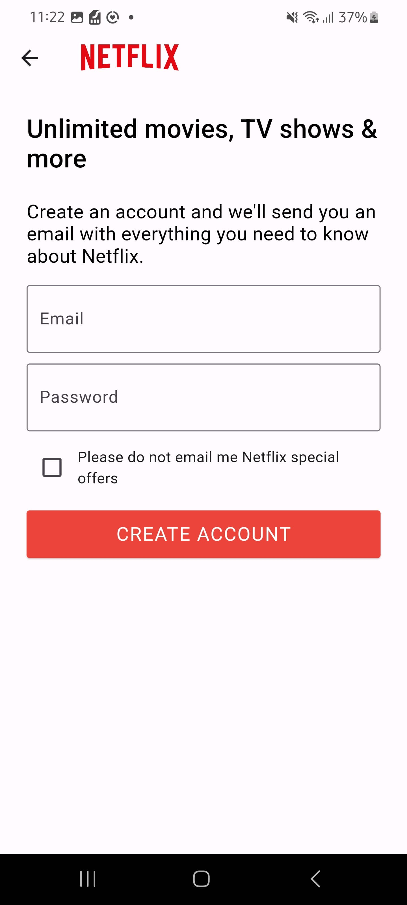

# 📺 Netflix Authentication Clone

This project is a clone of Netflix's authentication system built with Flutter and Firebase. It includes:

- Email/Password authentication using Firebase.
- State management with `StreamBuilder` to handle user sessions.
- A splash screen with navigation based on authentication state.

---

## 🚀 Features

- **Sign Up:** Create a new account using email and password.
- **Login:** Secure authentication for existing users.
- **Logout:** End the user session.
- **Navigation:** Redirect users to the home screen if authenticated, or to the login screen if not.

---

## 📸 Screenshots

**Splash Screen**  


**Login Screen**  


**Sign Up Screen**  


---

## 🔧 Installation & Setup

### 1. **Clone the Repository**

```bash
git clone https://github.com/YOUR_USERNAME/YOUR_REPOSITORY_NAME.git
cd YOUR_REPOSITORY_NAME
```

### 2. **Install the dependencies**

Ensure you have Flutter installed, then run:

```bash
flutter bub get
```

### 3. Create a Firebase Project

- Go to the Firebase Console.
- Create a new project.
- Add an Android and/or iOS app to the project.
- Download the `google-services.json` (for Android) and/or `GoogleService-Info.plist` (for iOS).
- Place them in the respective directories:
- `android/app/google-services.json`
- `ios/Runner/GoogleService-Info.plist`

### 4. Generate `firebase_options.dart`

Use the FlutterFire CLI to generate the Firebase configuration:

```bash
dart pub global activate flutterfire_cli
flutterfire configure
```

### 5. Enable Authentication in Firebase

- Go to **Firebase Console** > **Authentication** > **Sign-in method**.
- Enable **Email/Password** sign-in.

### 6. Run the App

```bash
fluter run
```

---

# ⚠️ Environment Variables

Ensure you DO NOT share your Firebase API keys publicly. The file `lib/firebase_options.dart` is ignored in `.gitignore` for security.

---

# 🛠️ Technologies Used

- **Flutter** for UI and state management.
- **Firebase** Authentication for managing user sessions.
- **StreamBuilder** for reactive state changes.

---

# 💡 Note

This project only covers the authentication part of Netflix. No video streaming is implemented.

---

# 📧 Contact

For queries or feedback, reach out at: **ahmedikram2003@gmail.com**
